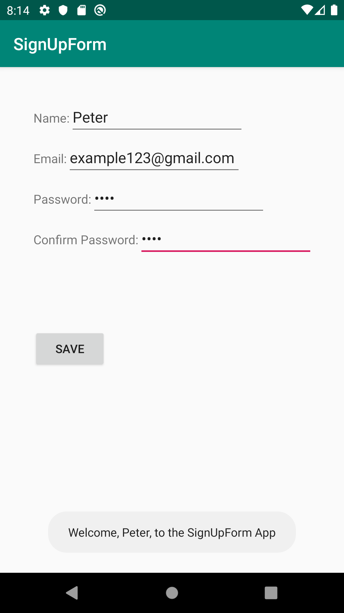

# SignUpForm

Function of the SignUpForm App:

The app displays a sign up form to the user. Its similar to normal sign up forms seen on the web. The form will ask the user for four fields, a name, an email, password, and a password confirmation. If any of the fields are empty, the app will promptly display a TOAST message saying "Please enter all information", and then if the passwords don't match another TOAST message saying "Passwords don't match" will be displayed to the user. Upon satisfying all requirements (filling in all fields and having matching passwords), a TOAST message will be displayed welcoming the user with the entered name.

